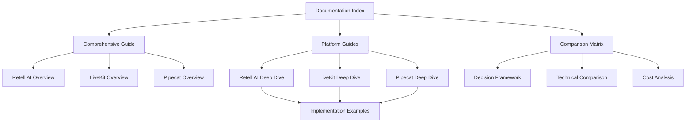

# Voice Agent Platforms: Complete Documentation Index

This repository contains comprehensive technical documentation for three major voice agent platforms. This index provides an organized overview of all available documentation.

## 📋 Overview Documents

### [Voice Agent Platforms: Comprehensive Guide](./platforms_guide.md)
**Main overview document** covering all three platforms with:
- Executive summary and platform comparisons
- Architecture overviews for each platform
- Flow orchestration deep dives
- Implementation examples
- Decision matrix for platform selection

### [Voice Agent Comparison Matrix](./Voice_Agent_Comparison_Matrix.md)
**Detailed comparison matrix** with:
- Side-by-side feature comparisons
- Technical architecture differences
- Cost structure analysis
- Use case suitability guidelines
- Migration considerations
- Decision framework

## 🎯 Platform-Specific Documentation

### Retell AI
- **[Retell AI Platform Guide](./Retell_AI_Platform_Guide.md)** - Comprehensive technical guide covering:
  - Platform architecture and components
  - Node-based conversation flow system
  - Function calling integration patterns
  - Advanced features and customization
  - Implementation examples and best practices

### LiveKit Agents
- **[LiveKit Agents Deep Dive](./LiveKit_Agents_Deep_Dive.md)** - Technical analysis covering:
  - Core architecture and component hierarchy
  - Voice components and agent lifecycle
  - Turn detection system variants
  - Audio processing pipeline details
  - Advanced patterns and implementations

### Pipecat & Pipecat-Flows
- **[Pipecat Comprehensive Guide](./Pipecat_Comprehensive_Guide.md)** - Complete technical guide covering:
  - Platform overview and architecture layers
  - Frame-based processing model
  - Pipeline framework construction
  - Flow orchestration with state machines
  - Transport and service integrations
  - Advanced flow patterns and optimization

## 📚 Source Materials

### [Retell AI Documentation](./retell.md)
Original Retell AI platform documentation covering:
- Conversation flow fundamentals
- Node types and configurations
- Function calling mechanisms
- Global settings and configurations

## 🔍 Key Topics Covered

### Flow Orchestration
Each platform implements conversation flow differently:
- **Retell AI**: JSON-based node configuration with visual editor
- **LiveKit Agents**: Code-first approach with Python async functions
- **Pipecat-Flows**: Hybrid approach with configurable state machines

### Function Calling
Different approaches to custom function integration:
- **Retell AI**: Webhook-based with automatic parameter extraction
- **LiveKit Agents**: Native Python async functions with direct integration
- **Pipecat-Flows**: Python functions with flow control and node transitions

### Context Management
Various strategies for conversation history:
- **Retell AI**: Automatic summarization with configurable strategies
- **LiveKit Agents**: Full manual control with custom implementations
- **Pipecat-Flows**: Configurable strategies with built-in options

### Turn Detection
Different methods for managing conversation turns:
- **Retell AI**: Automatic turn detection with built-in optimization
- **LiveKit Agents**: Multiple modes (VAD, STT, Realtime LLM)
- **Pipecat-Flows**: Transport-dependent with configurable options

## 🚀 Getting Started

### For Rapid Prototyping
1. Start with [Retell AI Platform Guide](./Retell_AI_Platform_Guide.md)
2. Review the [Comparison Matrix](./Voice_Agent_Comparison_Matrix.md) for quick decisions

### For Technical Deep Dive
1. Read the [Comprehensive Guide](./platforms_guide.md) for overview
2. Dive into platform-specific guides based on your needs
3. Use the [Comparison Matrix](./Voice_Agent_Comparison_Matrix.md) for detailed technical comparisons

### For Architecture Decisions
1. Review the [Decision Framework](./Voice_Agent_Comparison_Matrix.md#decision-framework)
2. Analyze use case suitability for each platform
3. Consider migration paths and long-term scalability

## 📊 Documentation Statistics

| Document | Lines | Focus Area | Technical Depth |
|----------|-------|------------|-----------------|
| Comprehensive Guide | ~700 | Overview + Comparison | Medium |
| Comparison Matrix | ~400 | Decision Making | Medium-High |
| Retell AI Guide | ~800 | Platform Deep Dive | High |
| LiveKit Agents Guide | ~500 | Platform Deep Dive | High |
| Pipecat Guide | ~600 | Platform Deep Dive | High |

## 🔄 Document Relationships

## 📝 Usage Guidelines

### For Developers
- Start with the comprehensive guide for platform overview
- Use platform-specific guides for implementation details
- Reference comparison matrix for technical decisions

### For Architects
- Focus on the comparison matrix for architectural decisions
- Review cost structures and scalability considerations
- Analyze migration paths between platforms

### For Product Managers
- Use the decision framework for platform selection
- Review use case suitability sections
- Consider time-to-market vs. long-term flexibility trade-offs

## 🔧 Implementation Support

Each platform guide includes:
- Complete code examples
- Configuration templates
- Best practices and common pitfalls
- Performance optimization tips
- Error handling patterns

## 📈 Next Steps

After reviewing this documentation:

1. **Identify your requirements** using the decision framework
2. **Select a platform** based on the comparison matrix
3. **Deep dive** into the platform-specific guide
4. **Implement** using the provided examples and patterns
5. **Optimize** using the performance guidelines

## 📞 Additional Resources

- **Retell AI**: Official documentation and API references
- **LiveKit Agents**: GitHub repository and community forums
- **Pipecat**: GitHub repository and example applications

This documentation provides a complete technical foundation for understanding and implementing voice agent solutions across all three major platforms. 